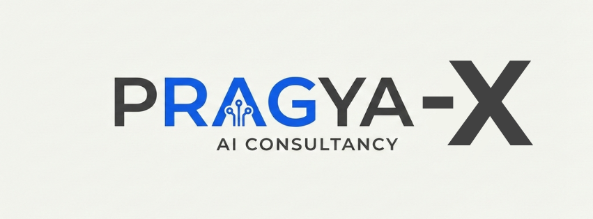

<div align="center">



<br/>

# 🎬 VidSage AI

### Ask Anything. About Any Video.

[](https://streamlit.io)
[](https://groq.com)
[](https://langchain.com)
[](https://python.org)
[](LICENSE)

**A Pragya-X AI Consultancy Product**

[🚀 Live Demo](#) · [📖 Docs](#how-it-works) · [🐛 Report Bug](issues) · [💡 Request Feature](issues)

</div>

---

## 🌟 What is VidSage AI?

**VidSage AI** is a production-grade **Multimodal RAG (Retrieval-Augmented Generation)** system that lets you have a natural language conversation with any video — YouTube links, direct uploads, or any video URL.

Paste a link. Ask a question. Get an intelligent answer — powered by **LLaMA 3.3 70B via Groq** and **OpenAI Whisper**.

> Built by **Hemanth Kumar** · Co-Founder, [Pragya-X AI Consultancy](https://pragya-x.com)

---

## ✨ Features

| Feature | Description |
|---|---|
| 🌐 **Universal Video Support** | YouTube URLs, direct MP4 uploads, any video link |
| 🎙️ **Whisper Transcription** | OpenAI Whisper converts speech to text with high accuracy |
| 🔍 **RAG Pipeline** | LangChain + ChromaDB vector store for precise retrieval |
| 🦙 **LLaMA 3.3 70B** | State-of-the-art LLM via Groq for blazing fast inference |
| 💬 **Multi-turn Chat** | Context-aware conversation across multiple questions |
| 🛡️ **Strict Grounding** | Answers only from video transcript — no hallucinations |
| 🔄 **Auto Session Reset** | Fresh vector store on every new video — zero contamination |
| 🎨 **Premium UI** | YouTube Premium + Apple design language |

---

## 🏗️ Architecture

```
┌─────────────────────────────────────────────────────────┐
│                     VidSage AI                          │
├─────────────────────────────────────────────────────────┤
│                                                         │
│  Video Input (YouTube / URL / Upload)                   │
│         │                                               │
│         ▼                                               │
│  yt-dlp → Audio Extraction (FFmpeg)                     │
│         │                                               │
│         ▼                                               │
│  OpenAI Whisper → Transcript                            │
│         │                                               │
│         ▼                                               │
│  LangChain Text Splitter → Chunks (500 tokens)          │
│         │                                               │
│         ▼                                               │
│  Embeddings → ChromaDB Vector Store                     │
│         │                                               │
│         ▼                                               │
│  User Question → Retriever (Top-5 chunks)               │
│         │                                               │
│         ▼                                               │
│  LLaMA 3.3 70B (Groq) → Answer                         │
│                                                         │
└─────────────────────────────────────────────────────────┘
```

---

## 🛠️ Tech Stack

| Layer | Technology |
|---|---|
| **Frontend** | Streamlit + Custom CSS (YouTube Premium + Apple Design) |
| **LLM** | LLaMA 3.3 70B via Groq API |
| **Transcription** | OpenAI Whisper (base model) |
| **RAG Framework** | LangChain + LangChain Community |
| **Vector Store** | ChromaDB (local, session-isolated) |
| **Audio Processing** | FFmpeg + yt-dlp |
| **Backend Language** | Python 3.11 |

---

## 🚀 Getting Started

### Prerequisites

- Python 3.11+
- FFmpeg installed ([Download here](https://ffmpeg.org/download.html))
- Groq API Key ([Get free key](https://console.groq.com))

### Installation

**1. Clone the repository**
```bash
git clone https://github.com/hemanth-titan-2026/VidSage-AI.git
cd VidSage-AI
```

**2. Create virtual environment**
```bash
python -m venv venv

# Windows
.\venv\Scripts\activate

# Mac/Linux
source venv/bin/activate
```

**3. Install dependencies**
```bash
pip install -r requirements.txt
```

**4. Setup environment variables**
```bash
# Create .env file
echo GROQ_API_KEY=your_groq_api_key_here > .env
```

**5. Run the app**
```bash
python -m streamlit run app/main.py
```

Open [http://localhost:8501](http://localhost:8501) 🎉

---

## 📁 Project Structure

```
VidSage-AI/
├── app/
│   ├── main.py              # Streamlit UI — Premium frontend
│   ├── video_processor.py   # yt-dlp + Whisper pipeline
│   └── rag_engine.py        # LangChain RAG + ChromaDB
├── pragya_x_logo.png        # Pragya-X branding
├── requirements.txt         # Python dependencies
├── .env                     # API keys (not committed)
├── .gitignore               # Git ignore rules
└── README.md                # This file
```

---

## ⚙️ How It Works

**Step 1 — Video Ingestion**
> yt-dlp downloads the audio track from any video source (YouTube, direct URL, etc.)

**Step 2 — Transcription**
> OpenAI Whisper (base model) transcribes the audio into text with high accuracy across multiple languages

**Step 3 — Chunking & Embedding**
> LangChain splits the transcript into 500-token chunks with 50-token overlap, then generates embeddings and stores them in ChromaDB

**Step 4 — Retrieval & Generation**
> User questions trigger a similarity search that retrieves the top 5 most relevant chunks, which are passed to LLaMA 3.3 70B via Groq for fast, grounded answer generation

**Step 5 — Strict Grounding**
> A custom system prompt enforces that the LLM answers ONLY from the retrieved transcript — preventing hallucinations

---

## 🔑 Environment Variables

| Variable | Description | Required |
|---|---|---|
| `GROQ_API_KEY` | Your Groq API key from [console.groq.com](https://console.groq.com) | ✅ Yes |

---

## 📦 Requirements

Create `requirements.txt`:

```
streamlit
langchain
langchain-community
langchain-groq
langchain-text-splitters
chromadb
yt-dlp
openai-whisper
python-dotenv
groq
```

---

## 🌐 Deployment

### Deploy on Streamlit Cloud (Free)

1. Push code to GitHub
2. Go to [share.streamlit.io](https://share.streamlit.io)
3. Connect your GitHub repo
4. Set `GROQ_API_KEY` in Secrets
5. Click Deploy! 🚀

### Secrets format for Streamlit Cloud:
```toml
GROQ_API_KEY = "your_groq_api_key_here"
```

---

## 🎯 Use Cases

- 📚 **Students** — Ask questions about lecture videos
- 🎓 **Researchers** — Extract insights from conference talks
- 💼 **Professionals** — Summarize meeting recordings
- 📰 **Content Creators** — Analyse competitor video content
- 🏢 **Businesses** — Extract knowledge from training videos

---

## 🗺️ Roadmap

- [x] YouTube URL support
- [x] Any video URL support
- [x] Multi-turn chat
- [x] Session isolation (no cross-video contamination)
- [ ] Video upload (direct MP4)
- [ ] Multi-language support
- [ ] Video summarization mode
- [ ] Quiz generation from video
- [ ] Export chat history as PDF
- [ ] Authentication system

---

## 👨‍💻 Author

**Nanneboina Hemanth Kumar**
- 🌐 [LinkedIn](https://www.linkedin.com/in/hemanth-kumar-nanneboina/)
- 🐙 [GitHub](https://github.com/hemanth-titan-2026)
- 📧 hemanthnanneboina35@gmail.com

---

## 🏢 About Pragya-X

**Pragya-X AI Consultancy** helps businesses grow with cutting-edge AI solutions — from RAG pipelines and LLM integrations to multi-agent systems and AI product development.

> *Transforming Businesses with AI* 🚀

---

## 📄 License

This project is licensed under the MIT License — see the [LICENSE](LICENSE) file for details.

---

<div align="center">

**Built with ❤️ by Hemanth Kumar · Pragya-X AI Consultancy**

⭐ Star this repo if you found it useful!

</div>
